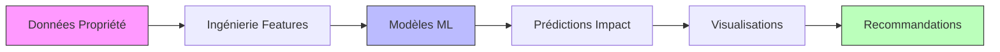
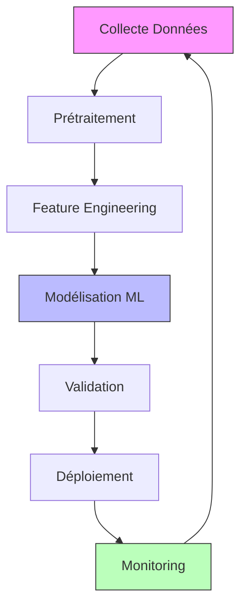

# 🏢 Analyseur Impact Bellevilles


> *L'immobilier au service de l'écologie, du lien et de la justice sociale*

Un outil d'analyse avancé alimenté par ML pour évaluer l'impact social, environnemental et financier des projets immobiliers. Développé pour Bellevilles, foncière solidaire engagée dans la transition écologique et sociale.

[English Version](#english-version) | [Documentation](#documentation) | [Installation](#installation) | [Vision 2025](#vision-2025)


## 📊 Caractéristiques Principales

- **Analyse d'Impact Triple**
  - 🤝 Impact Social
  - 🌱 Impact Environnemental
  - 💰 Viabilité Financière

- **Visualisations Avancées**
  - Analyse 3D interactive
  - Graphiques radar d'impact
  - Matrices de corrélation
  - Prévisions temporelles

- **Intelligence Artificielle**
  - Modèles ML ensemblistes
  - Quantification d'incertitude
  - Recommandations adaptatives
  - Analyse prédictive

## 🔄 Pipeline d'Analyse



## 🚀 Installation

1. **Cloner le repository**
```bash
git clone https://github.com/votre-username/analyseur-impact-bellevilles.git
cd analyseur-impact-bellevilles
```

2. **Créer l'environnement virtuel**
```bash
python -m venv venv
source venv/bin/activate  # Linux/Mac
# ou
venv\Scripts\activate     # Windows
```

3. **Installer les dépendances**
```bash
pip install -r requirements.txt
```

4. **Lancer l'application**
```bash
streamlit run app.py
```

## 🌐 Déploiement

### Local
```bash
streamlit run app.py --server.port 8501
```

### Docker
```bash
docker build -t analyseur-impact .
docker run -p 8501:8501 analyseur-impact
```

### Cloud (Streamlit Cloud)
1. Fork ce repository
2. Connectez-vous sur [share.streamlit.io](https://share.streamlit.io)
3. Déployez depuis votre fork

## 🎯 Vision 2025

Notre outil s'aligne sur les objectifs stratégiques de Bellevilles pour 2025 :

### Impact Social Augmenté
- Analyse prédictive des besoins communautaires
- Évaluation dynamique de l'accessibilité
- Metrics d'inclusion sociale

### Innovation Écologique
- Calcul d'empreinte carbone
- Potentiel de rénovation écologique
- Scores de durabilité

### Intelligence Territoriale
- Analyse des déséquilibres territoriaux
- Cartographie des besoins locaux
- Indicateurs de mixité sociale

## 📈 Pipeline de Développement



## 🛠️ Architecture Technique

```plaintext
analyseur-impact-bellevilles/
├── 📁 src/
│   ├── models.py          # Modèles ML
│   ├── features.py        # Ingénierie de features
│   ├── visualization.py   # Visualisations
│   └── utils.py          # Utilitaires
├── 📁 tests/             # Tests unitaires
├── 📁 notebooks/         # Notebooks d'analyse
├── 📝 app.py            # Application Streamlit
├── 📝 requirements.txt   # Dépendances
└── 📝 README.md         # Documentation
```

## 📊 Metrics d'Impact

| Metric | Description | Objectif 2025 |
|--------|-------------|---------------|
| Impact Social | Accessibilité et inclusion | > 8.5/10 |
| Impact Environnemental | Durabilité et efficacité | > 9.0/10 |
| Impact Financier | Viabilité économique | > 7.5/10 |

## 🤝 Contribution

1. Fork le projet
2. Créez votre branche (`git checkout -b feature/AmazingFeature`)
3. Committez vos changements (`git commit -m 'Add: Amazing Feature'`)
4. Push vers la branche (`git push origin feature/AmazingFeature`)
5. Ouvrez une Pull Request

## 📜 License

Distribué sous la licence MIT. Voir `LICENSE` pour plus d'informations.

## 🙏 Remerciements

- Équipe Bellevilles pour la vision et le support
- Communauté open-source pour les outils et frameworks
- Contributeurs du projet

---

---

**Contact:** : sameerm1421999@gmail.com
